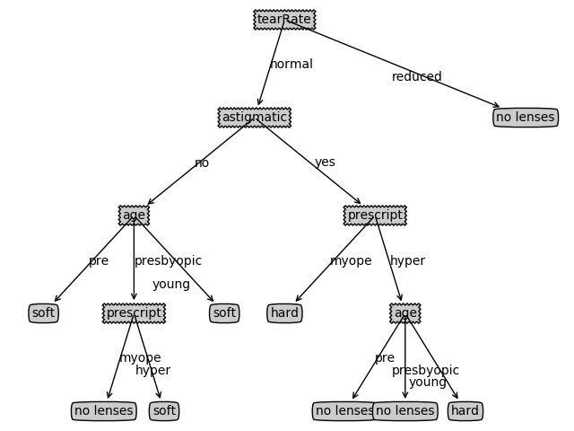

## 决策树小作业

### 1.原理

采用的是ID3算法。即，每次选择**信息增益最大**的特征。

#### 信息增益

信息熵定义如下：
$$
H(x)=-\sum_{i=1}^{n}p(i)log_2p(i)
$$
信息增益定义如下：
$$
Gain(D,A) = H(D) – H(D|A)
$$
即，数据集D的熵减去特征A条件下的数据集的熵。信息增益越大，减少的不确定性越多。

#### 简要流程

1. 若D中所有实例属于同一类$C_k$，则$T$为单结点树，并将类$C_k$作为该节点的类标记，返回$T$；
2. 若$A=\emptyset$，则$T$为单结点树，并将D中实例数最大的类$C_k$作为该节点的类标记，返回$T$；
3. 否则，计算$T$中特征对$T$的信息增益，选择信息增益最大的特征$A_k$。

### 2.核心代码

对应于算法的原理，核心代码如下：

```python
def create_tree(dataset: List[List[int]], labels: List[str]):
    class_list = [feats[-1] for feats in dataset]
    # 类别完全相同，T为单结点树，返回唯一的那个类
    if class_list.count(class_list[0]) == len(class_list):
        return class_list[0]
    # A为空集，T为单结点树，返回最大的类
    if len(dataset[0]) == 1:
        return majority_count(class_list)
    # 否则，计算信息增益，并选择最大信息增益项
    best_feat = choose_best_feature_to_split(dataset)
    best_feat_label = labels[best_feat]
    decision_tree = {best_feat_label: {}}
    del (labels[best_feat])
    feat_values = [feats[best_feat] for feats in dataset]
    unique_values = set(feat_values)
    # 构建决策树
    for value in unique_values:
        sub_labels = labels[:]
        decision_tree[best_feat_label][value] = create_tree(
            split_dataset(dataset, best_feat, value),
            sub_labels
        )
    return decision_tree
```

### 3.实验结果

原图片见`./result.png`。


